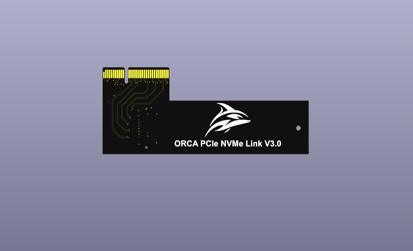
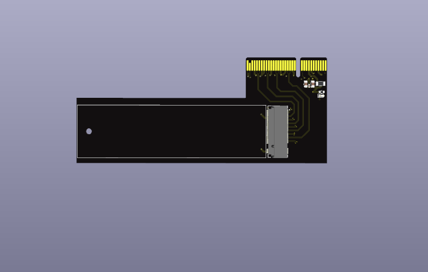
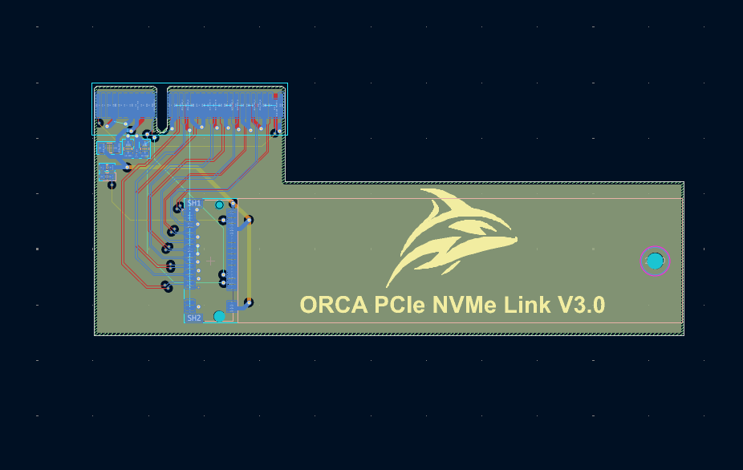
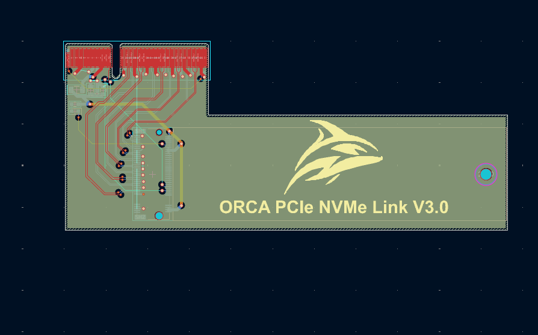
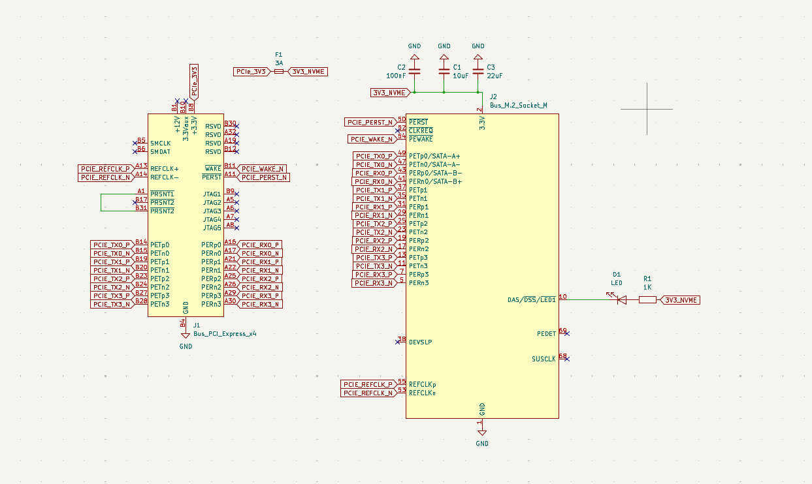

# ORCA PCIe NVMe Link

ORCA PCIe NVMe Link is a custom PCIe expansion board designed by Finn and branded ORCA Servers. It is intended to add M.2 NVMe storage through a PCIe x4 interface as part of the modular ORCA hardware platform.

## Features

- PCIe x4 host interface
- M.2 NVMe storage support
- Compact, modular storage expansion for the ORCA hardware platform
- Custom hardware design intended for further development and testing

## Project status

This project is in development. The design has not yet been represented as production-ready, and specifications, layout, and documentation may change.

## Repository contents

- `README.md` — project overview, current status, manufacturing warning, and rights notice
- `images/` — PCB renders, layout views, and a schematic overview

Additional design, fabrication, and supporting files may be added as the project develops.

## Design gallery

### PCB renders

| Front | Back |
| --- | --- |
|  |  |

### PCB layout

| Routed layout | Copper view |
| --- | --- |
|  |  |

### Schematic overview

## Manufacturing warning

Do not manufacture, assemble, sell, or rely on this hardware without an independent engineering review and appropriate electrical, signal-integrity, thermal, safety, and compatibility testing. Prototype hardware may contain errors and could damage connected equipment or storage devices. Manufacturing is also restricted by the rights notice below.

## Rights

This design was personally created by Finn and is branded ORCA Servers.

Copyright © 2026 Finn, trading as ORCA Servers. All rights reserved. No permission is granted to copy, modify, redistribute, manufacture, sell, or create derivative works from this design without prior written permission.
